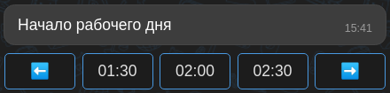

# pybotx-widgets

Примеры виджетов для pybotx. Могут быть использованы в проектах ботов.

---
### Установка

Выполните следующую команду в консоли:

`poetry add git+https://github.com/ExpressApp/pybotx-widgets.git`

---

### Виджет Carousel
#### Inline mode:
 



#### Newline mode:
 


---

### Виджет Calendar


#### `include_past=False` mode:


---

### Виджет Checklist


---

### Виджет Pagination


---

### Виджет Checktable


---
### Пример использования виджета Carousel:

```python
from pybotx_widgets.carousel import carousel
from botx import MessageMarkup

...

@collector.handler(command="/some_command", name="some_command_name")
async def some_command(message: Message, bot: Bot) -> None:
    markup = MessageMarkup()
    selected_value = await carousel(
        message,
        bot,
        widget_content,  # All content to be displayed
        label,  # Text of message
        command_name="some_command_name",  # Arg for 'bot.command_for()' method. Used for bubbles 'command' attribute
        start_from=0,  # Start display content from
        displayed_content_count=3,  # Count of content to be displayed
        selected_value_label="You selected: {selected_val}",  # Display format of the selected value, default = "{label} {selected_val}"
        control_labels=("", ""),  # Override default control labels
        inline=False,  # Inline mode
        loop=False,  # Loop content or not
        show_numbers=False,  # Show content order numbers for prev/next control bubbles' labels. Default = False
        additional_markup=markup  # Additional markup for attaching to widget
    )
    
    if selected_value:
        ...  #  do something
```
При первом вызове виджета он просто отобразится и значение переменной `selected_value` будет `None`

Когда пользователь нажмет на `bubble` виджет возьмет значение из `message.command.data` и вернет его

Если виджет должен обновить уже отправленное сообщение, то добавьте в `message.command.data` ключ `message_id` 
с UUID сообщения, которое нужно обновить

Когда `loop=True`, стрелки отображаются всегда

Если выбранное значение нужно получить в другом хэндлере, то используйте функцию `get_carousel_result`:
```python
from pybotx_widgets.carousel import get_carousel_result

carousel_result = get_carousel_result(message, bot)
```
Это позволит избежать длинного вызова виджета `carousel` с передачей всех его параметров.

---

### Пример использования виджета Calendar:

```python
from pybotx_widgets.calendar import calendar

...

@collector.handler(command="/some_command", name="some_command_name")
async def some_command(message: Message, bot: Bot) -> None:
    selected_value = await calendar(
        message, 
        bot,
        start_date: date = None,  # Calendar start date, previews dates hides, default date.today()
        end_date: date = date.max,  # Calendar end date, next dates hides, default date.max
        command_name="some_command_name",  # Arg for 'bot.command_for()' method. Used for bubbles 'command' attribute
        include_past=False,  # Include past dates in calendar, default is False
        additional_markup=None  # Additional markup for attaching to widget, default None
    )

    if selected_value:
        ...  #  do something
```
При первом вызове виджета он просто отобразится и значение переменной `selected_value` будет `None`

Когда пользователь нажмет на `bubble` виджет возьмет значение из `message.command.data` и вернет его

Если виджет должен обновить уже отправленное сообщение, то добавьте в `message.command.data` ключ `message_id` 
с UUID сообщения, которое нужно обновить

---

### Пример использования виджета Checklist:

```python
from pybotx_widgets.checklist import checklist, get_checked_items

...

@collector.handler(command="/some_command")
async def some_command(message: Message, bot: Bot) -> None:
    current_selected_item = await checklist(
        message,
        bot,
        content,  # All content to be displayed
        label,  # Text of message
        "some_command_name",  # Arg for 'bot.command_for()' method. Used for bubbles 'command' attribute
    )

    if current_selected_item:
        ...  #  do something
    
    all_selected_items = get_checked_items(message)
    
    if all_selected_items:
        ...  #  do something
```
При первом вызове виджета он просто отобразится и значение переменной `current_selected_item` будет `None`

Когда пользователь нажмет на `bubble` виджет возьмет значение из `message.command.data` и вернет его

Список всех выбранных элементов можно получить через `get_checked_items(message)`

Если виджет должен обновить уже отправленное сообщение, то добавьте в `message.command.data` ключ `message_id` 
с UUID сообщения, которое нужно обновить

---

### Пример использования виджета Pagination:

```python
from pybotx_widgets.pagination import pagination

...

@collector.handler(command="/some_command")
async def some_command(message: Message, bot: Bot) -> None:
    await pagination(
        message,
        bot,
        content,  # All content to be displayed: List[Tuple[str, MessageMarkup]]
        paginate_by, # Number of messages on one page        
        "some_command_name",  # Arg for 'bot.command_for()' method. Used for bubbles 'command' attribute
    )
```
Если виджет должен обновить уже отправленное сообщение, то добавьте в `message.command.data` ключ `message_id` 
с UUID сообщения, которое нужно обновить

---

### Пример использования виджета Checktable:

```python
from pybotx_widgets.checktable import checktable

...

@collector.handler(command="/some_command")
async def some_command(message: Message, bot: Bot) -> None:
    await checktable(
        message,
        bot,
        content,  # All content to be displayed: List[CheckboxContent]
        label, # Text of message
        "uncheck_command", # Command for handler which uncheck value         
        "some_command",  # Command for bubbles command attribute
        additional_markup  # Additional markup for attaching to widget
    )
```
Для корректной работы виджета нужно создать хэндлер с командой `uncheck_command` и прописать в нем поведение при сбрасывании значения.

#### Пример хэндлера:

```python
from pybotx_widgets.checktable import checktable
from pybotx_widgets.undefined import undefined

...

UNCHECK_COMMAND = "/_checkbox:uncheck"

@collector.hidden(command=UNCHECK_COMMAND)
async def checkbox_uncheck(message: Message, bot: Bot) -> None:
    field_name = message.data.get("field_name")
    my_object = await get_my_object()
    
    setattr(my_object, field_name, undefined)
    await set_my_object(my_object)
        
    checkboxes = await build_checkboxes(my_object)
    await checktable(message, bot, my_object, "some_label", UNCHECK_COMMAND)
```

---

## ЭМОДЗИ
В `pybotx_widgets.resources.strings` есть следующие эмодзи:

LEFT_ARROW = ⬅️ <br/>
RIGHT_ARROW = ➡️ <br/>
UP_ARROW = ⬆️ <br/>
DOWN_ARROW = ⬇️ <br/>
CHECKBOX_CHECKED = ☑ <br/>
CHECKBOX_UNCHECKED = ☐ <br/>
CHECK_MARK = ✔️ <br/>
ENVELOPE = ✉️ <br/>
PENCIL = ✏️ <br/>
CROSS_MARK = ❌ <br/>
